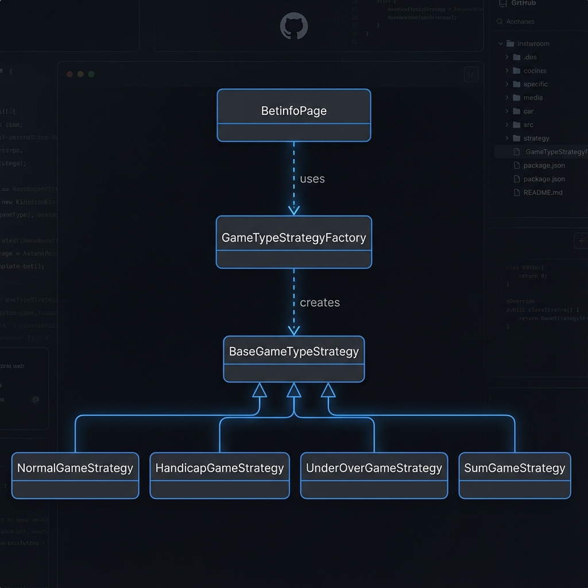

# BetinfoPage 리팩토링 : 분기 처리 로직의 객체 위임 (2025-12-17)

## 1. 문제 상황: 비대해지는 if-else 체인

기존 `BetinfoPage` 클래스는 경기 유형(일반, 핸디캡, 언더오버 등)이 추가될 때마다 파싱 로직 내의 `if-else` 분기가 계속 늘어나는 구조였습니다. 유형이 많아질수록 핵심 메서드가 길어져 가독성이 떨어졌고, 새로운 유형을 추가할 때 기존 코드를 건드려야 하는 부담이 컸습니다.

**당시 코드의 불편했던 점:**
- 새로운 경기 유형이 생기면 무조건 `BetinfoPage` 파일을 열어 `elif`를 추가해야 했습니다.
- 브라우저 제어 로직과 데이터 파싱 로직이 한데 섞여 있어 수정 범위가 모호했습니다.

## 2. 해결 방법: 전략 객체로의 책임 분산

경기 유형별 파싱 로직을 별도 클래스로 떼어내고, 상황에 맞는 객체를 팩토리가 반환하도록 설계했습니다.

**Before (if-else 중심의 타입 판별)**
```python
def _determine_game_type(self, img_src: str) -> str:
    # 유형이 추가될 때마다 이 함수는 끝없이 길어집니다.
    if "ico_all.gif" in img_src:
        return "일반"
    elif "ico_handicap.gif" in img_src:
        return "핸디캡"
    elif "ico_uo.gif" in img_src:
        return "언더오버"
    elif "ico_sum.gif" in img_src:
        return "SUM"
    return "일반"
```

**After (팩토리를 통한 전략 위임)**
```python
# 이제 BetinfoPage는 상세 로직을 몰라도 됩니다.
game_type_strategy = GameTypeStrategyFactory.create_strategy(game_type_img)
game_type = game_type_strategy.identify_type_name()
result_data = game_type_strategy.parse_result(td_element)
```

## 3. 구조 변경 후의 작업 방식

이제 새로운 경기 유형을 추가해야 할 때, 저는 기존 파싱 엔진을 건드리지 않고 전략 클래스만 새로 정의합니다.

**신규 유형 추가 예시:**
```python
class NewGameTypeStrategy(BaseGameTypeStrategy):
    def matches(self, img_src: str) -> bool:
        return "ico_new.gif" in img_src
    def identify_type_name(self) -> str:
        return "신규유형"
    # parse_result 상세 구현...
```

특정 유형의 데이터가 잘못 추출된다면 해당 전략 파일 하나만 열어보면 됩니다. 각 파일은 30줄 내외로 유지되어 로직 파악이 훨씬 빨라졌습니다.

## 4. 설계 상세 및 흐름

### 파일 구조
```
parser/game_type_strategies/
├── base_game_type_strategy.py
├── normal_game_strategy.py
├── handicap_game_strategy.py
└── ... (유형별 전략들)

parser/odds_strategies/
├── base_odds_strategy.py
└── ... (배당 데이터 추출 전략들)
```

### 아키텍처 다이어그램


### 코드 통계
| 항목 | Before | After | 변화 |
|------|--------|-------|------|
| `betinfo_page.py` 라인 수 | 253 | 199 | -54 줄 |
| `if-else` 분기 수 | 6개 | 0개 | -6개 |
| 전체 코드 라인 수 | 253 | ~600 | +347 줄 |

## 5. 마무리
파일 개수는 늘어났지만, 각 클래스의 책임이 명확해진 덕분에 코드를 고칠 때 느끼는 심리적 부담이 많이 줄었습니다. 앞으로 어떤 복합적인 경기 유형이 추가되어도 파서 엔진만큼은 안정적으로 유지할 수 있을 것 같습니다.
